  

   
   

  <strong>Marketing by trade. Tech by obsession.</strong> 
  I write, shape ideas, and build small systems when the workflow gets annoying.

   
   

  
  
  
  
  

 

## Profile

Content marketer with a builder streak.

I care about clear ideas, good writing, strong taste, and tools that make the boring parts lighter.

> Good work should feel like someone cared.

 

 

## Now

`content strategy` · `storytelling` · `automation` · `vibe code` · `internet culture`

I build small things, test ideas, and keep what earns its place.

 

## This space

Part notebook, part playground. Experiments, workflow ideas, scraps, and tiny tools that grew out of curiosity.

 

