<div align="center">
  

  <br />
  <br />

  <strong>Marketing by trade. Tech by obsession.</strong><br />
  <sub>I make content, shape ideas, and build small systems when the workflow gets messy.</sub>

  <br />
  <br />

  
  
  
  
  
</div>

<br />

## 01 / PROFILE

Content marketer with a builder streak.

I write, shape ideas, and make small systems when the workflow starts getting annoying. Sometimes that means strategy. Sometimes automation. Sometimes vibe-coding a tiny tool because I got tired of doing the same thing twice.

I care about clear thinking, good writing, strong taste, and work that still feels human after the tools are done with it.

> I like making things that read well, move well, and feel like someone cared.

<br />

## 02 / CURRENT FREQUENCY

<table>
<tr>
<td width="50%" valign="top">

### Making

- content strategy and narrative systems
- campaign angles and repeatable formats
- lighter publishing workflows
- small automations that remove boring steps
- tiny tools made mostly out of curiosity

</td>
<td width="50%" valign="top">

### Watching

- internet culture and audience behavior
- why some ideas travel and others disappear
- how taste changes when everyone has the same tools
- new creative workflows worth keeping
- technology that actually earns its place

</td>
</tr>
</table>

<br />

## 03 / EDITORIAL CODE

```txt
clarity before clever
find the signal
cut the noise
make it felt
keep the voice human
build the boring parts away
ship something worth remembering
```

<br />

## 04 / WORKING MATERIALS

<div align="center">

`words` · `research` · `story` · `distribution` · `automation` · `prompts` · `vibe code` · `internet taste`

</div>

<br />

## 05 / THIS SPACE

This GitHub is part notebook, part playground, part evidence that curiosity tends to become a project eventually.

Expect experiments, small systems, prompt scraps, workflow ideas, half-serious prototypes, and whatever I found interesting enough to build instead of just bookmarking.

<br />

<div align="center">
  <sub>WORDS FOR HUMANS / SYSTEMS FOR SCALE</sub>
</div>
